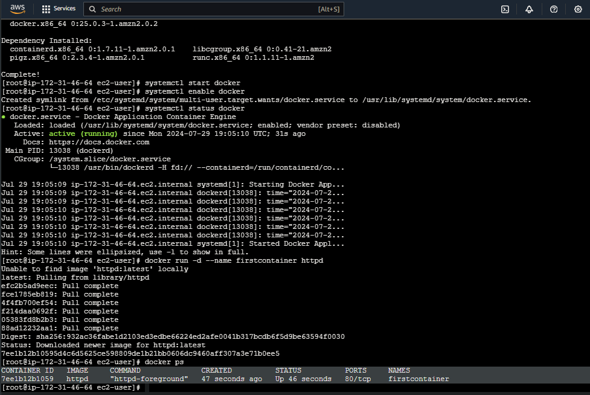

# Getting Started with Docker - Installation and Setup

## Overview

This project provides a step-by-step guide for installing Docker on an Amazon EC2 instance and running a sample Docker container. It is designed to help beginners get started with Docker and AWS. The instructions are straightforward and include all necessary commands to complete the setup.

**Note:** This project involves using AWS resources, which may incur costs. Ensure you are aware of potential charges and monitor your AWS usage to avoid unexpected costs.

## Prerequisites

- An AWS account with IAM credentials.
- An EC2 instance running Amazon Linux.

## Steps


# Task 1: Sign in to AWS Management Console

# Task 2: SSH into EC2 Instance Using the Key Pair

# Task 3: Install Docker Engine on the Instance

```bash
# Switch to the root user
sudo su

# Update the package index
yum -y update

# Install Docker Engine
yum install docker -y

# Start the Docker service
systemctl start docker

# Enable Docker to start on boot
systemctl enable docker

# Check the Docker service status
systemctl status docker

```

# Task 4: Create a Sample Docker Container
```bash
# Run a sample web server container
docker run -d --name firstcontainer httpd

# Verify that the container is running
docker ps

```

## Documentation

- **Docker Documentation:** [Docker Official Documentation](https://docs.docker.com/reference/)
- **AWS Documentation:** [AWS Official Documentation](https://docs.aws.amazon.com/)

## License

This project is licensed under the MIT License. See the [LICENSE](LICENSE) file for details.


